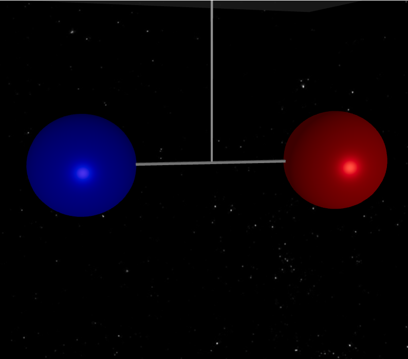
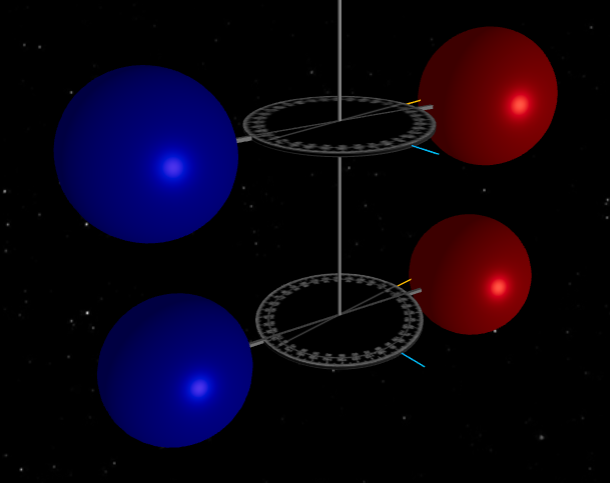

# Simulador de Físico - Pendulos de Torsíon

Este es un simulador de física desarrollado con React y Vite.
Permite observar a detalle el comportamiento de un pendulo  de tosión oscilando en diferentes entornos, incluso acoplado a otro pendulo de torsión.

## Despliegue en GitHub Pages
usando el enlace a la pagina en gt pages puede acceder e interactuar con el programa en cualquier momento en caso de estar disponible a la fecha
[Prueba la aplicacion](https://fabergg.github.io/SimuladorFisica/)

## Tabla de Contenidos

- [Características](#características)
- [Requisitos](#requisitos)
- [Clonar el Proyecto](#clonar-el-proyecto)
- [Instalación](#instalación)
- [Ejecutar el Proyecto](#ejecutar-el-proyecto)
- [Colaborar](#colaborar)
- [Tecnologías Usadas](#tecnologías-usadas)

## Características
- Simulaciones interactivas sobre vibracones y sus modos.
- Graficas en tiempo real del movimiento del pendulo
- Diferentes modos de movimiento (armonico simple, amortiguado, forzado)
- Interfaz de usuario intuitiva, con posibilidad de cambiar parametros y visualizar los valores calculados.
### Pendulo de torsion en diferentes modos de movimiento
El programa permite seleccionar entre los 4 diferentes tipos de movimiento
-armonico simple
-Amortiguado
-Forzado no amortiguado
-Forzado amortiguado
Adicionalmente permite cambiar valores de posicion inicial, dimensiones y constantes

### Pendulos de torsion acoplados
Se modelan pendulos acoplados y se calculan las posiciones para cada pendulo independiente
Se muestran las graficas asi como los valores obtenidos.
Se muestra el modo de vibracion (siincronico/asincronico)



## Requisitos

- [Node.js](https://nodejs.org/) (versión 14 o superior)
- [npm](https://www.npmjs.com/) o [yarn](https://yarnpkg.com/) (opcional)

## Clonar el Proyecto

Para clonar este repositorio, utiliza el siguiente comando:

```bash
git clone https://github.com/FaberGG/SimuladorFisica.git
```

## Instalación

Una vez que hayas clonado el repositorio, navega a la carpeta del proyecto:

```bash
cd SimuladorFisica
```

Luego, instala las dependencias:

```bash
npm install
```

## Ejecutar el Proyecto

Para iniciar el servidor de desarrollo, utiliza el siguiente comando:

```bash
npm run dev
```

Esto abrirá la aplicación en `http://localhost:3000` (o el puerto que se indique en la terminal).

## Colaborar

1. **Fork** el repositorio en GitHub.
2. Crea una nueva rama para tu característica o corrección:
    
    ```bash
    git checkout -b nombre-de-la-rama
    ```
3. Realiza tus cambios y agregalos antes de hacer el commit:
    
    ```bash
    git add .
    ```    
3. Realiza tus cambios y haz un commit:
    
    ```bash
    git commit -m "Descripción de los cambios"
    ```
    
4. Sube tus cambios a tu rama:
    
    ```bash
    git push origin nombre-de-la-rama
    ```
    
5. Crea un **Pull Request** en el repositorio original.

## Tecnologías Usadas

- [React](https://reactjs.org/)
- [Vite](https://vitejs.dev/)
- [Three.js](https://threejs.org/)
- [React Three Fiber](https://github.com/utsuboco/react-three-fiber)
- [drei](https://github.com/pmndrs/drei)
